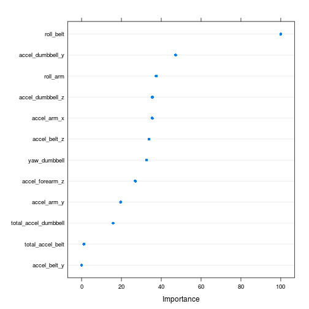

Practical machine learning course assignment
========================================================

## Introduction

The course assignment studies the Weight Lifting Exercise dataset available from http://groupware.les.inf.puc-rio.br/har and its purpose is to predict the manner of the weight lifting based on measurements. There are 5 manners of weight lifting described the "classe" variable and it has 5 values: A, B, C, D and E. A corresponds to the correct way of weight lifting and the rest describe typical mistakes in weight lifting.

## Data processing

The data is contained in two files that are downloaded from the weblinks given in the assignment into the working directory


```r
if (!file.exists("pml-training.csv")) {
    url <- "https://d396qusza40orc.cloudfront.net/predmachlearn/pml-training.csv"
    download.file(url, "pml-training.csv", method="curl")
}
if (!file.exists("pml-testing.csv")) {
    url <- "https://d396qusza40orc.cloudfront.net/predmachlearn/pml-testing.csv"
    download.file(url, "pml-testing.csv", method="curl")
}
```

The file "pml-training.csv" contains the data based on which the model to predict the outcome is built and tested on. The model is then used to predict the outcomes of the cases in the file "pml-testing.csv". The datasets contain missing values of 3 types: NA, #Div/0! and empty cells. Since we do not know anything more about these types, they are all made NAs while reading in the files into R


```r
training <- read.csv("pml-training.csv", stringsAsFactors=FALSE, na.strings=c("NA", "", "#DIV/0!"))
testing <- read.csv("pml-testing.csv", stringsAsFactors=FALSE, na.strings=c("NA", "", "#DIV/0!"))
```

Next the structure of missing values for each variable needs to be investigated


```r
missingVals <- is.na(training)
missColSums <- colSums(missingVals)
table(missColSums)
```

```
## missColSums
##     0 19216 19217 19218 19220 19221 19225 19226 19227 19248 19293 19294 
##    60    67     1     1     1     4     1     4     2     2     1     1 
## 19296 19299 19300 19301 19622 
##     2     1     4     2     6
```

The training dataset contains `{r} nrow(training)` observations. Thus it is seen that the variables with missing values have almost all of their observations missing and the likely course of action is to impute these variables completely from the dataset. Before doing the structure of the missing values is analyzed further using the variable "new_window" with two values: "yes" and "no"


```r
training_yes <- subset(training, new_window=="yes")
training_no <- subset(training, new_window=="no")
table(colSums(is.na(training_yes)))
```

```
## 
##   0   1   2   4   5   9  10  11  32  77  78  80  83  84  85 406 
## 127   1   1   1   4   1   4   2   2   1   1   2   1   4   2   6
```

```r
nrow(training_yes)
```

```
## [1] 406
```

```r
table(colSums(is.na(training_no)))
```

```
## 
##     0 19216 
##    60   100
```

```r
nrow(training_no)
```

```
## [1] 19216
```

This shows that the "no"-subset has only two types of variables: ones with all observations and ones with all missing values. The "yes"-subset has a lot more structure. On the other hand the "yes"-subset is much smaller containing only 406 observations compare to 19216 observations in "no"-subset. Looking at the missing value structure of the testing dataset


```r
table(colSums(is.na(testing)))
```

```
## 
##   0  20 
##  60 100
```

```r
testing$new_window
```

```
##  [1] "no" "no" "no" "no" "no" "no" "no" "no" "no" "no" "no" "no" "no" "no"
## [15] "no" "no" "no" "no" "no" "no"
```

All the testing cases belong to "no"-subset and have the same structure of missing values as the "no"-subset of the training dataset. This is confirmed by comparing amounts of missing values for a variable in the training "no"-subset and testing dataset


```r
missing_vals_tr_no <- colSums(is.na(training_no))
missing_vals_test <- colSums(is.na(testing))
sum(missing_vals_tr_no==0 & missing_vals_test==0)
```

```
## [1] 60
```

```r
names_tr_no <- names(training_no)[missing_vals_tr_no==0]
names_test <- names(testing)[missing_vals_test==0]
length(names_tr_no)
```

```
## [1] 60
```

```r
length(names_test)
```

```
## [1] 60
```

```r
sum(names_tr_no==names_test)
```

```
## [1] 59
```

```r
names_tr_no[names_tr_no!=names_test]
```

```
## [1] "classe"
```

```r
names_test[names_tr_no!=names_test]
```

```
## [1] "problem_id"
```

Thus the variables with no missing values are the same in both datasets. The only difference is the classe variable in the training set and problem_id in the testing set. The 60 variables with no missing values are kept for further analysis and in the training dataset only the "no"-subset is kept for analysis. The "yes"-subset contains only 406 cases compared to the 19216 cases in the "no"-subset. Thus the "yes"-subset would not have a big statistical significance, unless the values it contains are somehow outliers which might result to distortions of results. Keeping the "no"-subset only keeps also with the structure of the testing dataset.


```r
training_no <- training_no[, names_tr_no]
testing <- testing[, names_test]
```

Some of the variable in the beginning of the data frames are not useful for predicting the results


```r
head(training_no[, 1:10])
```

```
##   X user_name raw_timestamp_part_1 raw_timestamp_part_2   cvtd_timestamp
## 1 1  carlitos           1323084231               788290 05/12/2011 11:23
## 2 2  carlitos           1323084231               808298 05/12/2011 11:23
## 3 3  carlitos           1323084231               820366 05/12/2011 11:23
## 4 4  carlitos           1323084232               120339 05/12/2011 11:23
## 5 5  carlitos           1323084232               196328 05/12/2011 11:23
## 6 6  carlitos           1323084232               304277 05/12/2011 11:23
##   new_window num_window roll_belt pitch_belt yaw_belt
## 1         no         11      1.41       8.07    -94.4
## 2         no         11      1.41       8.07    -94.4
## 3         no         11      1.42       8.07    -94.4
## 4         no         12      1.48       8.05    -94.4
## 5         no         12      1.48       8.07    -94.4
## 6         no         12      1.45       8.06    -94.4
```

The first 7 variables from X to num_window are not useful for predicting, so they are removed


```r
training_no <- training_no[, -(1:7)]
testing <- testing[, -(1:7)]
```

The variable to be predicted "classe" needs to be changed into a factor and the number of variables left is


```r
training_no$classe <- as.factor(training_no$classe)
ncol(training_no)
```

```
## [1] 53
```


## Feature selection

The model has a large number of variables, 52, for prediction. However, a lot of these variables are not so good for prediction. In the experiment correct way of biceps curl and four typical mistakes are measured while an instructor supervises the movement. The weight is also small so that it does not cause any problems. Therefore it is expected that the movements in the certain category should be close to the mean for a variable that measures well the movement. Having large numbers of outliers, points beyond the whiskers in the box-whisker plot, could be an indication of problems with the variable escpecially if they are on one side only. Having some outliers is not surprising since there are 19216 observations in the final training dataset being used, but only variables with small amounts of outliers are chosen here.

Start by loading the necessary libraries


```r
library(lattice)
library(ggplot2)
library(caret)
library(randomForest)
```

```
## randomForest 4.6-10
## Type rfNews() to see new features/changes/bug fixes.
```

The prediction variables left are of 4 different types: Euler angles, accelerations, gyros and magnets. These are given in different scales so they are plotted within these groups. Starting with box-plots of Euler angles


```r
featurePlot(x=training_no[,grepl("roll", names(training_no)) | grepl("pitch", names(training_no)) | grepl("yaw", names(training_no))], y=training_no$classe, plot="box")
```

 

From these yaw_dumbbell and roll_belt do not contain outliers, roll_arm contains a few, so they are chosen from angles. The rest of the angles contain more outliers.

Next the total accelarations


```r
featurePlot(x=training_no[,grepl("total", names(training_no))], y=training_no$classe, plot="box")
```

 

From these total_accel_belt does not have outliers and total_accel_dumbbell contains a few so they are chosen for prediction variables.

Next acceleration components


```r
featurePlot(x=training_no[,grepl("accel", names(training_no)) & !grepl("total", names(training_no))], y=training_no$classe, plot="box")
```

 

From these accel_dumbbell_y, accel_dumbbell_z, accel_forearm_z, accel_belt_y, accel_belt_z, accel_arm_x and accel_arm_y are chosen.

There are still gyros and magnet variables. However, these turned out to contain lots of outliers in every case, so they were not plotted. The following codes would produce the plots for these variables


```r
featurePlot(x=training_no[,grepl("gyros", names(training_no))], y=training_no$classe, plot="box")
```


```r
featurePlot(x=training_no[,grepl("magnet", names(training_no))], y=training_no$classe, plot="box")
```


```r
featurePlot(x=training_no[,grepl("gyros_arm", names(training_no)) | grepl("gyros_belt", names(training_no))], y=training_no$classe, plot="box")
```

Now the training and testing datasets are restricted to the chosen variables and including the classe and problem_id


```r
train2 <- training_no[, c("yaw_dumbbell", "roll_arm", "roll_belt", "total_accel_dumbbell", "total_accel_belt", "accel_dumbbell_y", "accel_dumbbell_z", "accel_forearm_z", "accel_belt_y", "accel_belt_z", "accel_arm_x", "accel_arm_y", "classe")]
test2 <- testing[, c("yaw_dumbbell", "roll_arm", "roll_belt", "total_accel_dumbbell", "total_accel_belt", "accel_dumbbell_y", "accel_dumbbell_z", "accel_forearm_z", "accel_belt_y", "accel_belt_z", "accel_arm_x", "accel_arm_y", "problem_id")]
```

For further confirmation a pair plot is formed of the chosen variables in the training data. This is a big plot that is better looked at in a large screen


```r
featurePlot(x=train2[, 1:(ncol(train2)-1)], y=train2$classe, plot="pairs", auto.key=list(columns=5))
```

 

It is seen that there is a lot of splitting of data. However, the alternative E tends wander everywhere in the splitted sets. Nevertheless model fitting is tried with these variables

## Fitting a model

Since there is no knowledge of which variables are important, the random forest is fitted with 5-fold cross validation used automatically in the train-function


```r
set.seed(8421)
fitControl <- trainControl(method="cv", number=5, classProbs=TRUE)
rfFit1 <- train(classe~yaw_dumbbell+roll_arm+roll_belt+total_accel_dumbbell+total_accel_belt+accel_dumbbell_y+accel_dumbbell_z+accel_forearm_z+accel_belt_y+accel_belt_z+accel_arm_x+accel_arm_y, data=train2, method="rf", trControl=fitControl)
rfFit1
```

```
## Random Forest 
## 
## 19216 samples
##    12 predictor
##     5 classes: 'A', 'B', 'C', 'D', 'E' 
## 
## No pre-processing
## Resampling: Cross-Validated (5 fold) 
## 
## Summary of sample sizes: 15373, 15372, 15371, 15374, 15374 
## 
## Resampling results across tuning parameters:
## 
##   mtry  Accuracy   Kappa      Accuracy SD  Kappa SD   
##    2    0.9548818  0.9429278  0.002735547  0.003450752
##    7    0.9547779  0.9428072  0.002543546  0.003206488
##   12    0.9507706  0.9377364  0.001938200  0.002449255
## 
## Accuracy was used to select the optimal model using  the largest value.
## The final value used for the model was mtry = 2.
```

Looking at the results: the resample accuracies whose average produces the model accuracy, confusion matrix for the training data and variable importance


```r
rfFit1$resample
```

```
##    Accuracy     Kappa Resample
## 1 0.9544627 0.9423911    Fold1
## 2 0.9508325 0.9378240    Fold2
## 3 0.9560125 0.9443440    Fold5
## 4 0.9583550 0.9473165    Fold4
## 5 0.9547464 0.9427634    Fold3
```

```r
confusionMatrix(rfFit1)
```

```
## Cross-Validated (5 fold) Confusion Matrix 
## 
## (entries are percentages of table totals)
##  
##           Reference
## Prediction    A    B    C    D    E
##          A 27.6  0.5  0.2  0.3  0.1
##          B  0.2 18.1  0.4  0.1  0.1
##          C  0.3  0.5 16.4  0.6  0.2
##          D  0.3  0.2  0.4 15.5  0.1
##          E  0.1  0.1  0.0  0.0 17.9
```

```r
varImp(rfFit1)
```

```
## rf variable importance
## 
##                      Overall
## roll_belt            100.000
## accel_dumbbell_y      47.158
## roll_arm              37.463
## accel_dumbbell_z      35.528
## accel_arm_x           35.476
## accel_belt_z          33.886
## yaw_dumbbell          32.572
## accel_forearm_z       26.977
## accel_arm_y           19.624
## total_accel_dumbbell  15.816
## total_accel_belt       1.157
## accel_belt_y           0.000
```

```r
dotPlot(varImp(rfFit1))
```

 

The variable importance order tells in which order the variables are being dropped in case that is necessary. Some of the steps are skipped although they were analyzed. Here moving on to the interesting parts


```r
set.seed(8421)
fitControl <- trainControl(method="cv", number=5, classProbs=TRUE)
rfFit4 <- train(classe~yaw_dumbbell+roll_arm+roll_belt+accel_dumbbell_y+accel_dumbbell_z+accel_forearm_z+accel_belt_z+accel_arm_x+accel_arm_y, data=train2, method="rf", trControl=fitControl)
rfFit4
```

```
## Random Forest 
## 
## 19216 samples
##    12 predictor
##     5 classes: 'A', 'B', 'C', 'D', 'E' 
## 
## No pre-processing
## Resampling: Cross-Validated (5 fold) 
## 
## Summary of sample sizes: 15373, 15372, 15371, 15374, 15374 
## 
## Resampling results across tuning parameters:
## 
##   mtry  Accuracy   Kappa      Accuracy SD  Kappa SD   
##   2     0.9566512  0.9451711  0.002515681  0.003178481
##   5     0.9549859  0.9430735  0.001986491  0.002508512
##   9     0.9496258  0.9362918  0.003110685  0.003941616
## 
## Accuracy was used to select the optimal model using  the largest value.
## The final value used for the model was mtry = 2.
```

This shows that dropping unimportant variables has actually increased accuracy from 0.9549 to 0.9567 when dropping three of the variables, so they were not very important.


```r
rfFit4$resample
```

```
##    Accuracy     Kappa Resample
## 1 0.9581056 0.9470064    Fold1
## 2 0.9542144 0.9421063    Fold2
## 3 0.9562728 0.9446822    Fold5
## 4 0.9601770 0.9496313    Fold4
## 5 0.9544863 0.9424294    Fold3
```

```r
confusionMatrix(rfFit4)
```

```
## Cross-Validated (5 fold) Confusion Matrix 
## 
## (entries are percentages of table totals)
##  
##           Reference
## Prediction    A    B    C    D    E
##          A 27.6  0.4  0.2  0.2  0.1
##          B  0.2 18.2  0.4  0.1  0.1
##          C  0.3  0.5 16.5  0.5  0.2
##          D  0.3  0.2  0.4 15.5  0.1
##          E  0.1  0.1  0.0  0.0 17.9
```

```r
varImp(rfFit4)
```

```
## rf variable importance
## 
##                  Overall
## roll_belt        100.000
## accel_dumbbell_y  37.038
## accel_dumbbell_z  24.899
## accel_belt_z      23.475
## roll_arm          22.846
## accel_arm_x       16.751
## yaw_dumbbell      13.511
## accel_forearm_z    8.339
## accel_arm_y        0.000
```

Dropping the next variable produces an interesting result


```r
set.seed(8421)
fitControl <- trainControl(method="cv", number=5, classProbs=TRUE)
rfFit5 <- train(classe~yaw_dumbbell+roll_arm+roll_belt+accel_dumbbell_y+accel_dumbbell_z+accel_forearm_z+accel_belt_z+accel_arm_x, data=train2, method="rf", trControl=fitControl)
rfFit5
```

```
## Random Forest 
## 
## 19216 samples
##    12 predictor
##     5 classes: 'A', 'B', 'C', 'D', 'E' 
## 
## No pre-processing
## Resampling: Cross-Validated (5 fold) 
## 
## Summary of sample sizes: 15373, 15372, 15371, 15374, 15374 
## 
## Resampling results across tuning parameters:
## 
##   mtry  Accuracy   Kappa      Accuracy SD  Kappa SD   
##   2     0.9506147  0.9375267  0.003018424  0.003828196
##   5     0.9513953  0.9385232  0.002985387  0.003781200
##   8     0.9460351  0.9317404  0.002387418  0.003026987
## 
## Accuracy was used to select the optimal model using  the largest value.
## The final value used for the model was mtry = 5.
```

The accuracy has decreased by dropping a variable, but the variable importance order has changed


```r
rfFit5$resample
```

```
##    Accuracy     Kappa Resample
## 1 0.9497788 0.9364633    Fold1
## 2 0.9479844 0.9342077    Fold3
## 3 0.9516129 0.9388220    Fold2
## 4 0.9515877 0.9387533    Fold5
## 5 0.9560125 0.9443696    Fold4
```

```r
confusionMatrix(rfFit5)
```

```
## Cross-Validated (5 fold) Confusion Matrix 
## 
## (entries are percentages of table totals)
##  
##           Reference
## Prediction    A    B    C    D    E
##          A 27.5  0.4  0.3  0.2  0.1
##          B  0.2 18.1  0.4  0.2  0.1
##          C  0.3  0.6 16.2  0.5  0.2
##          D  0.3  0.2  0.5 15.5  0.2
##          E  0.1  0.1  0.0  0.0 17.8
```

```r
varImp(rfFit5)
```

```
## rf variable importance
## 
##                  Overall
## roll_belt        100.000
## accel_dumbbell_y  22.415
## roll_arm          19.431
## accel_arm_x       15.155
## accel_dumbbell_z  13.525
## accel_forearm_z    8.312
## yaw_dumbbell       2.125
## accel_belt_z       0.000
```

This shows an example of why one should drop only one variable at a time. The accuracy gives also the expected out of sample error as a complement of the accuracy, so for rfFit4 the expected out of sample error is 1-0.9567=0.0433 and for rfFit5 it is 1-0.9514=0.0486 so it is around 4-5%.

## Predictions for the testing data

The predictions are calculated for the models in the following way


```r
pred_test4 <- predict(rfFit4, test2)
pred_test4 <- as.character(pred_test4)
pred_test5 <- predict(rfFit5, test2)
pred_test5 <- as.character(pred_test5)
```

Since the results are separately submitted, they are not presented here. The answers are written to the files using the function provided


```r
pml_write_files = function(x){
    n = length(x)
    for(i in 1:n) {
        filename = paste0("problem_id_", i, ".txt")
        write.table(x[i], file=filename,quote=FALSE, row.names=FALSE,
                    col.names=FALSE)
    }
}
pml_write_files(pred_test)
```

```
## Error in pml_write_files(pred_test): object 'pred_test' not found
```

The produced error in writing to file is deliberate, since the number has been left out in pred_test.

The expected error rate for the models are 4-5% so roughly 1 out of 20 times the prediction is wrong. Indeed the testing data submission gave for both rfFit4 and rfFit5 19 out of 20 correct and 1 out of 20 incorrect, but the incorrect prediction was for different test case. This shows the importance of fitting multiple models to improve accuracy.
